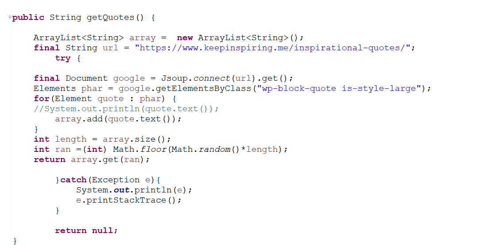
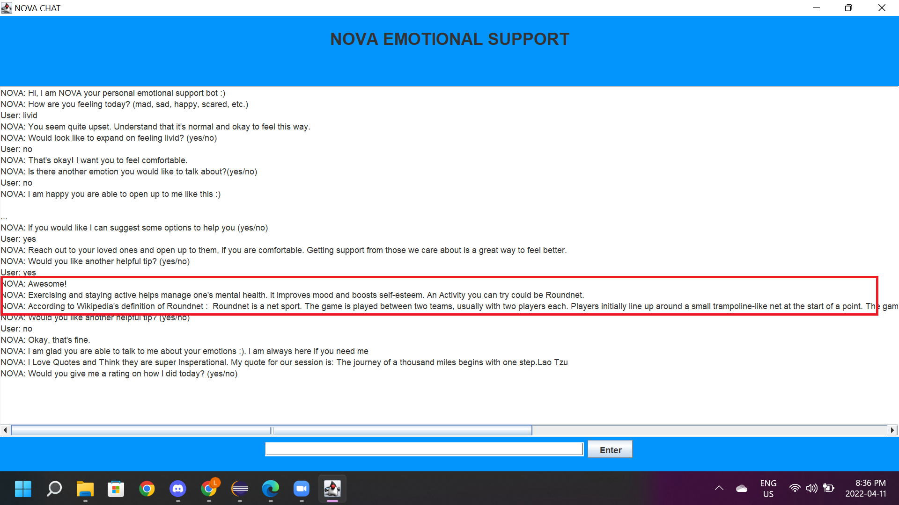
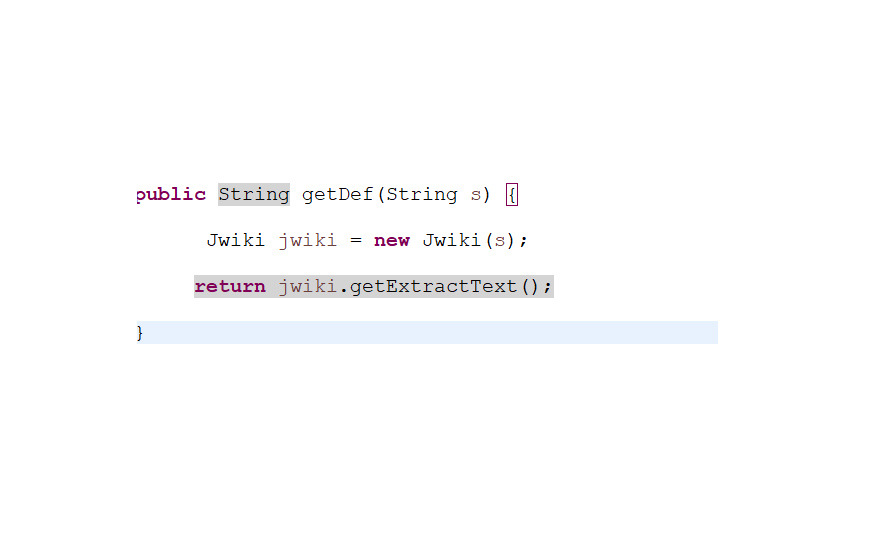

# 310_individual_project_LucadeVerteuil

# Assignment_3
COSC-310 Group 8's repository

<!--  PROJECT TITLE -->

<h3 align="center">NOVA-ChatBot</h3>
  
Your Personal Emotional Support Bot

<!--  TABLE OF CONTENTS -->

  
Table of Contents

  <ol>
    <li>
      <a href="#about-the-project">About The Project</a>
      <ul>
        <li><a href="#built-with">Built With</a></li>
        <li><a href="#user-requirements">User Requirements</a></li>
        <li><a href="#system-requirements">System Requirements Specifications</a></li>
      </ul>
    </li>
    <li>
      <a href="#Installation Guide">Installation Guide</a>
    </li>
    <li>
      <a href="#New Features">New Features</a>
    </li>
    <li><a href="#license">License</a></li>
  </ol>

<!-- ABOUT THE PROJECT -->
## About The Project

The NOVA chatbot is an emotional support agent that helps the user deal with the emotions they are feeling to give them support and provide them with options to  help them feel better and maintain their mental health. 

(<a href="#top">back to top</a>)

### Built With

* [Java](https://www.java.com/en/)
* [Stanford POS Tagger Toolkit](https://nlp.stanford.edu/software/tagger.shtml)
* [RiTa API for WordNet](https://rednoise.org/rita/)
* [WordNet Toolkit](https://wordnet.princeton.edu/)
* [Stanford Sentiment Analysis Toolkit](https://nlp.stanford.edu/sentiment/)

(<a href="#top">back to top</a>)

### User Requirements

Nova-ChatBot is able to hold a conversation of over 30 dialogues in order to talk through the user's emotion and help them feel better, while giving them helpful options to improve their mental heatlh. Lastly Nova-ChatBot will conclude the conversation and ask for a rating on how well it performed. 

(<a href="#top">back to top</a>)

### System Requirements Specifications

1. NOVA matches keywords from user input with its internal architecture to provide accurate responses to the input. 
2. Keywords and Responses are pulled from .txt files. 
3. Synonyms for programmed emotions are cross-referenced with the text files to check if the input contains an emotion.
4. NOVA is able to detect user emotions (Angry, Happy, Sad, Scared).
5. NOVA has various responses 
6. NOVA System is robust for future implementations. 

(<a href="#top">back to top</a>)

<!-- INSTALLATION GUIDE -->

## Installation Guide

To get a local copy up and running on your local device. You must have the Java Development Kit installed. Due to the size limit on GitHub, we are unable to upload a certain jar and the exectuable JAR file for NOVA. Here is the link to a zip folder of the completed project, which contains the runnable NOVA.jar and the necessary JARS for the toolkits to make the program run (one of which was too big to add to github): 
[Project Zip](https://drive.google.com/drive/folders/1dEy8bMCkDBM5gqvkkwdmoXUNeEwpF6Oy?usp=sharing)

(<a href="#top">back to top</a>)

<!-- NEW FEATURES -->

## New Features
With Nova Chat Bot I have added two new Apis to the project, [Jsoup](https://jsoup.org/download) and [Jwiki](https://github.com/viralvaghela/Jwiki/blob/master/README.md). Jsoup has been added to the project to be able to find meaningful quotes from famous people to help relate to the user The quotes were gotten from "https://www.keepinspiring.me/inspirational-quotes/". 

The secound Api, Jwiki was implement to help users who dont know coping mechanisims that Nova Chat bot segests are from wikipedia. And example is if users dont know what meditation or spike ball is the bot will send them the definition on the wikipida page

<!-- LICENSE -->

## License

MIT License 

(<a href="#top">back to top</a>)

